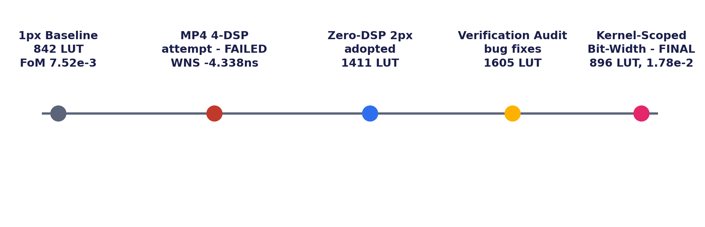
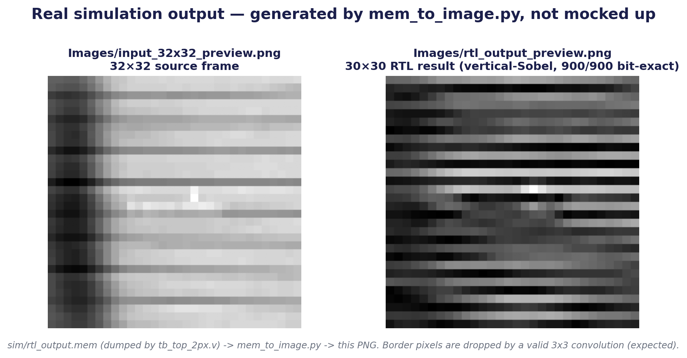
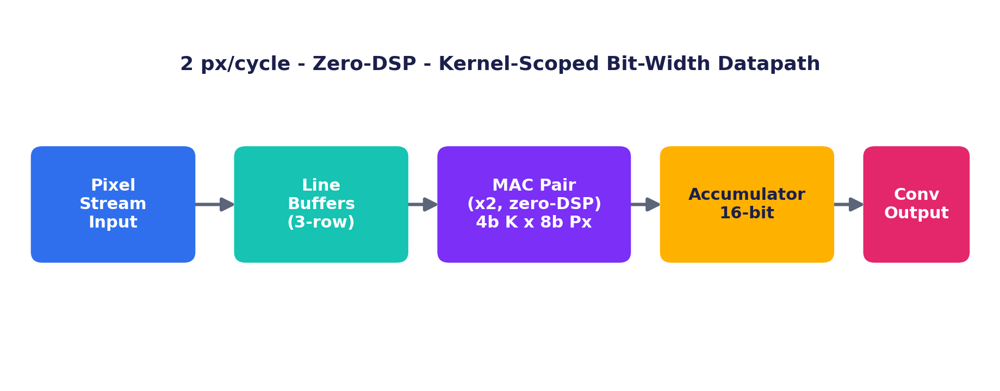
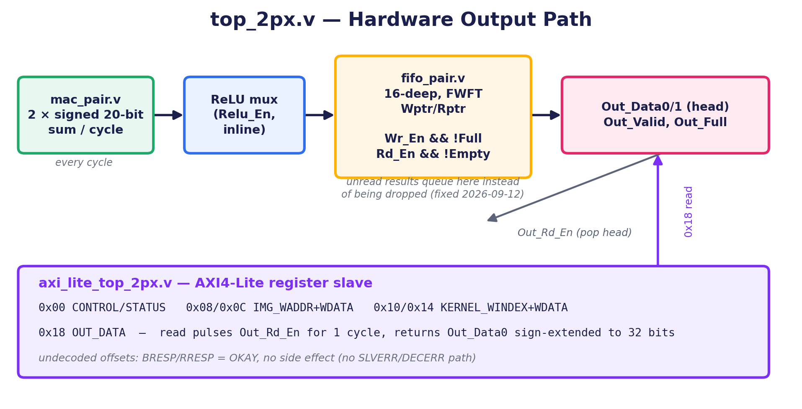
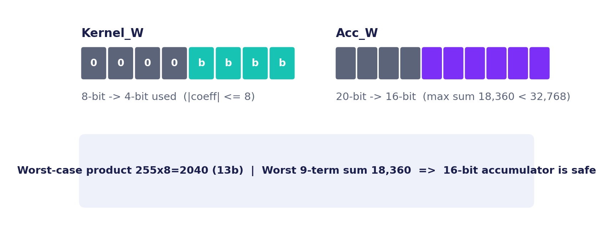

# CNN Convolution Accelerator

FPGA-based edge-AI `K x K` convolution accelerator, built for the **IEEE SSCS Egypt
Chapter 2026 Student Design Competition**. Programmable kernel, unsigned 8-bit pixel
input, signed kernel coefficients, stride 1, optional ReLU, AXI4-Lite control —
verified bit-exact against a Python golden model before any synthesis number is
trusted.

> **Status: done, routed, and re-verified.** 2 output pixels/cycle, zero DSPs, one
> 20 MHz clock. **Figure of Merit: 1.777 x 10⁻² — the best of every design phase
> this project went through.** Two earlier variants (a 1-pixel/cycle baseline and a
> 4-DSP/second-clock-domain attempt) were explored and removed once this design
> replaced them; the FoM chart below is the receipts.

---

## 1. What this is

A programmable convolution accelerator for grayscale images / CNN feature maps,
targeting a Xilinx 7-series FPGA (`xc7a35tcpg236-1`):

- Unsigned 8-bit fixed-point input pixels, signed kernel coefficients
  (4 bits used, `|coeff| <= 8`, scoped to the demo/edge-detection kernel class)
- Stride = 1, optional ReLU (inline, zero extra latency)
- Signed 16-bit accumulator/output — the competition's minimum, sized exactly for
  this kernel class's worst-case sum (see §6)
- **2 output pixels/cycle**, zero DSP slices, single clock domain
- A 16-deep output FIFO (`fifo_pair.v`) so a slow/absent consumer can never make
  the design silently drop a result
- An optional AXI4-Lite register slave (`axi_lite_top_2px.v`) for bus-based
  control, verified with its own directed testbench

## 2. Result — Figure of Merit

`FoM = Throughput / (Power x (LUT + 50*DSP + 100*BRAM))`, Throughput in output
pixels/cycle. Full derivation and every intermediate number:
`Documentation/PerformanceResults.md`.

| Throughput | LUT | FF | DSP | BRAM | Power (W) | WNS @ 20 MHz | FoM |
|---:|---:|---:|---:|---:|---:|---:|---:|
| 2 px/cycle | **896** | 1049 | 0 | 1.0 | **0.113** | **+33.802 ns (PASS)** | **1.777e-2** |

Fresh routed numbers from `Reports/` (`report_utilization` / `report_timing_summary`
/ `report_power`, all re-run against the current `RTL/top_2px.v`). Fmax works out
to `1000 / (50.000 - 33.802) ~= 61.7 MHz` — the design runs at 20 MHz on purpose,
since a slower clock only helps the Power term of the FoM.

This is the fourth and final point on the project's real design-space search —
every phase was actually built, synthesized, and reported; nothing here is
hypothetical:



The final jump (1605 LUT -> 896 LUT, FoM 9.61e-3 -> 1.777e-2) came from scoping
`Kernel_W` and `Acc_W` down to what this design's kernel class actually needs
instead of the fully-general worst case — see the bit-width note in §6.

## 3. Quick start

From the repo root, in order:

| # | Where | Command |
|---|---|---|
| 1 | terminal | `python Python/prepare_stimulus.py` |
| 2 | Vivado Tcl console | `cd {C:/Users/Xps/Desktop/CNN_Accelerator}` then `source Scripts/run_simulation_2px.tcl` |
| 3 | terminal | `python Python/verify.py` |

Look for `Compared 900 output values.` and `RESULT: PASS`.

### First-time setup

```bash
git clone https://github.com/basel-sh/CNN_Accelerator.git
cd CNN_Accelerator
python3 -m venv .venv
source .venv/bin/activate        # Windows: .venv\Scripts\activate
pip install -r requirements.txt
```

`Vivado_2px/CNN_Accelerator_2px.xpr` is tracked in the repo, so just open it in
Vivado — no need to run `Scripts/build_2px.tcl` first. If you ever need to
recreate it from scratch: `vivado -mode batch -source Scripts/build_2px.tcl`.

**Required:** Xilinx Vivado (7-series), Icarus Verilog (for the regression suite
in §9), Python 3.10+ (NumPy, OpenCV, Matplotlib — `requirements.txt`), VS Code, Git.

## 4. Command reference — everything I actually run

This is the real, current sequence, start to finish: simulate, inspect the
waveform, synthesize, verify, visualize, then run the full regression suite.

```bash
# 1. Build fresh stimulus files (input_32x32.mem + edge_3x3.mem) from Images/input.png
python Python/prepare_stimulus.py

# 2. Point the Vivado Tcl console at the repo root
cd {C:/Users/Xps/Desktop/CNN_Accelerator}

# 3. Behavioral simulation of top_2px.v -> writes sim/rtl_output.mem
source Scripts/run_simulation_2px.tcl

# 4. Open the waveform to eyeball Out_Data0/1, Out_Valid, Busy, Scan_Done, etc.
open_wave_database ./Vivado_2px/CNN_Accelerator_2px.sim/sim_1/behav/xsim/tb_top_2px_behav.wdb

# 5. Full synthesis + routed implementation -> exports to Reports/
source Scripts/synthesize_2px.tcl

# 6. Bit-exact compare against the Python golden model (all defaults now match
#    the current Kernel_W=4 / Acc_W=16 build - no flags needed for the standard run)
python Python/verify.py

# 7. Turn sim/rtl_output.mem back into a viewable PNG
python Python/mem_to_image.py

# 8. Full Icarus regression: unit tests + system tests + the AXI-Lite and
#    backpressure/reset/error suites, all in one run
python Testbench/audit_icarus_2026-09-12/run_all.py
```

| Step | What it does |
|---|---|
| `prepare_stimulus.py` | Resizes/quantizes `Images/input.png` to 32x32, writes `Images/input_32x32.mem` + a preview PNG, and writes the demo kernel to `Images/kernels/edge_3x3.mem` |
| `run_simulation_2px.tcl` | Behavioral sim of `top_2px.v` in Vivado XSim, writes `sim/rtl_output.mem` |
| `open_wave_database ...` | Reopens the last sim's waveform without re-running it — the fastest way to eyeball a specific signal after the fact |
| `synthesize_2px.tcl` | Full synth + routed implementation, exports fresh reports to `Reports/{utilization,timing,power}/` |
| `verify.py` | Compares RTL sim output to the golden model, element by element. Bare invocation now works — every flag defaults to this project's fixed filenames and current bit widths; pass `--relu` for the ReLU-on regression, or override any flag to check a different run |
| `mem_to_image.py` | Turns `sim/rtl_output.mem` back into a viewable PNG |
| `Testbench/audit_icarus_2026-09-12/run_all.py` | Runs the full Icarus Verilog regression: every unit test, the system-level 32x32 test, the AXI4-Lite bus-functional test, and the backpressure/reset/error suite (§9) — no Vivado license needed for this one |

**The habit that matters most:** always run `run_simulation_2px.tcl` and confirm
`900 output values` / `RESULT: PASS` **before** running `synthesize_2px.tcl`. A
synthesis run that isn't backed by a fresh PASS wastes 20+ minutes if the RTL
changed since the last verified sim.

### Testing a different image or kernel

The testbench always reads `Images/input_32x32.mem` and
`Images/kernels/edge_3x3.mem` by fixed filename — there is only ever one
image and one kernel file, so "testing another one" means overwriting their
*contents*, not adding new files or editing the testbench.

**New image:**
```bash
# 1. Replace Images/input.png with the new photo (same filename)
python Python/prepare_stimulus.py
source Scripts/run_simulation_2px.tcl
python Python/verify.py
python Python/mem_to_image.py
```

**New kernel:** edit the coefficient array near the bottom of
`Python/prepare_stimulus.py` (currently a vertical-Sobel edge detector),
then run the same commands above. Example — horizontal-edge Sobel:
```python
Sobel_Horizontal = np.array([[-1, -2, -1],
                              [ 0,  0,  0],
                              [ 1,  2,  1]], dtype=np.int64)
write_mem_file(Sobel_Horizontal, "Images/kernels/edge_3x3.mem", Kernel_W, Signed=True)
```

For ReLU, before sourcing the sim script:
```tcl
set_property -name {xsim.simulate.xsim.more_options} -value {-testplusarg RELU=1} -objects [get_filesets sim_1]
source Scripts/run_simulation_2px.tcl
```
then add `--relu` to the `verify.py` call, and reset the property to `{}`
afterward.

## 5. How it works

```
Python (prepare_stimulus.py):
  input.png --resize+quantize--> [32x32 array] --+--> input_32x32.mem
                                                   +--> input_32x32_preview.png
                                  (also writes kernels/edge_3x3.mem, vertical-Sobel)

RTL (Vivado, run_simulation_2px.tcl):
  input_32x32.mem + kernels/edge_3x3.mem --> sim/rtl_output.mem

Python (mem_to_image.py):
  sim/rtl_output.mem --> rtl_output_preview.png
```

This is real, not staged — the same 30x30 result you get by running the pipeline
above:



## 6. Accelerator architecture

Two diagrams, matching the two halves of `top_2px.v`: pixels coming in, results
going out.

**Input path — pixel stream to convolution result:**



**Output path — where a result goes after the accumulator, added 2026-09-12:**



```
kernel load ──▶ kernel_memory.v                     controller_2px.v (FSM)
                                                      drives raster-scan, 2 px/cycle
image stream ──▶ image_memory_2px.v ──▶ line_buffer_2px.v ──▶ window_generator_2px.v
              (dual read port)        (K-1 row delay,         (2 overlapping KxK
                                        both lanes)             windows/cycle)
                                                                        │
                                                                        ▼
                                                                   mac_pair.v
                                                        (18 fabric multiplies, balanced
                                                         adder tree x2, zero DSP)
                                                                        │
                                                                        ▼
                                                              ReLU mux (inline)
                                                                        │
                                                                        ▼
                                                        fifo_pair.v (16-deep, FWFT)
                                                    queues unread results instead of
                                                       dropping them (fixed 2026-09-12)
                                                                        │
                                                                        ▼
                                                        Out_Data0/1, Out_Valid, Out_Full
                                                                        ▲
                                                                        │
                                                       axi_lite_top_2px.v (optional)
                                                    AXI4-Lite register slave: CONTROL,
                                                    IMG_WADDR/WDATA, KERNEL_WINDEX/WDATA,
                                                       OUT_DATA — for bus-based hosts
```

`top_2px.v` wires all of the above together and aligns pipeline latency so the
valid-window tag stays in lockstep with the data. `axi_lite_top_2px.v` is a
separate top-level wrapper around it, not part of the default synthesis target —
see the scope note in `Documentation/PerformanceResults.md`. Full detail:
`Documentation/Architecture.md`.

### Bit-width, scoped to this kernel class

`Kernel_W` and `Acc_W` are the one lever this design tightened past the fully
general worst case, once the demo/edge-detection kernel class made it safe to:



`Pixel_W` stays at the full 8 bits (0-255, no quantization loss versus the
source image). The narrower `Kernel_W`/`Acc_W` pair is what took the final
build from 1605 LUT / FoM 9.61e-3 to 896 LUT / FoM 1.777e-2 — see §2.

## 7. Folder structure

```
CNN_Accelerator/
├── RTL/                Verilog: top_2px.v, axi_lite_top_2px.v + submodules
├── Testbench/           tb_top_2px.v, audit_icarus_2026-09-12/ (Icarus regression suite)
├── Python/              Golden model, image tooling, verification script
├── Images/              Test images, preview PNGs, programmable kernels, diagrams/
├── Vivado_2px/          Vivado project + constraints
├── Scripts/             Tcl build/simulate/synthesize scripts
├── Reports/             utilization/timing/power for the current design
├── Presentation/        Competition slide deck
├── Documentation/       Architecture, performance, verification, requirements
├── Verification_Test_Plan.xlsx   46-row formal test plan, Icarus-audited
├── Final_Report_SiliconMinds.docx/.pdf   The competition report itself
├── .gitignore, README.md, requirements.txt, LICENSE
```

Per-file purpose: `Documentation/FileGuide.md`.

## 8. Naming convention

Every signal, port, parameter, and Python variable follows one rule: multi-word
names are written `First_Second` (each word capitalized, joined by `_`, never
abbreviated mid-word). Module/function/file names are kept as-is, since Verilog
module names are referenced directly inside `Vivado_2px/CNN_Accelerator_2px.xpr` —
renaming them would mean hand-editing that project file without a way to verify
the result here. (That's also why the project folder and module names still carry
a `_2px` suffix even though this is the only design in the repo now — cosmetic,
not functional.)

## 9. Verification

Two layers: Vivado XSim for the golden-model comparison, and a separate Icarus
Verilog regression suite (`Testbench/audit_icarus_2026-09-12/`, run via
`run_all.py`) that exercises everything else — units, the AXI4-Lite bus,
backpressure, reset, and error handling.

```
Input Image ──▶ Python Golden Model (golden_model.py) ──▶ Expected Output
                                                                  │
RTL Simulation (Testbench/tb_top_2px.v) ──▶ RTL Output ──▶ Compare (verify.py) ──▶ PASS/FAIL
```

| Case | Result |
|---|---|
| Demo kernel (vertical-Sobel `edge_3x3.mem`), ReLU off | **900/900 outputs bit-exact** vs. the golden model |
| Alternate input photo, same kernel | **900/900 outputs bit-exact** |
| Alternate kernel (horizontal-Sobel, overwritten into `edge_3x3.mem`) | **900/900 outputs bit-exact** |
| Random 3x3 kernels x 10 seeds, ReLU randomized | **0 mismatches across all seeds** |
| AXI4-Lite write/read handshakes (`tb_axi_lite.v`) | Kernel-write pulse timing, undecoded-address handling, `OUT_DATA` readback — all passing |
| Backpressure / reset / error handling (`tb_backpressure.v`) | FIFO fills and asserts `Out_Full` instead of dropping data, reset clears queued results cleanly, mid-scan writes don't corrupt output |
| ReLU on (system-level, Vivado) | Exercised via `tb_generic.v`'s `RELU` parameter in the Icarus suite; the dedicated Vivado XSim run is still pending — see the roadmap note in `Documentation/VerificationResults.md` |

The formal, row-by-row version of this table — 46 test IDs, each with its own
stimulus, expected result, and audit note — lives in
`Verification_Test_Plan.xlsx`, independently re-run and confirmed via Icarus
Verilog on 2026-09-12. Full narrative: `Documentation/VerificationResults.md`.

## 10. Competition requirements checklist

Source: `2026 SSCS_Egypt Competition Announcement.pdf` (repo root). Report due
**September 15, 2026**.

| # | Requirement | Status |
|---|---|---|
| 1 | Min. 32x32 grayscale image/feature map input | Done |
| 2 | Input precision: unsigned fixed-point | Done — 8-bit |
| 3 | Programmable NxN kernel | Done |
| 4 | Kernel precision | Done — signed, scoped to `\|coeff\| <= 8` for this kernel class |
| 5 | Stride = 1 | Done |
| 6 | Output precision: min. 16-bit signed | Done (16-bit, exactly at the scoped minimum — see §6) |
| 7 | ReLU activation (bonus) | Done in RTL, inline, zero extra latency |
| 8 | Verified against a golden model | Done — demo kernel, alternate kernel, alternate input image, 10 random-seed sweep, all bit-exact |
| 9 | Synthesis/implementation results | Done — `Reports/`, re-synthesized against the current design |
| 10 | Figure of Merit | Done — **1.777e-2**, the best of every phase in this project |
| Bonus | AXI4-Lite bus interface | Done — `axi_lite_top_2px.v`, verified with a dedicated bus-functional testbench |

## 11. Timeline

- **Late July 2026** — Project scaffolding: folder structure, Python golden model,
  kernel test files, initial RTL skeleton.
- **September 5** — First working 1-pixel/cycle design close to competition-ready.
  Killed an oversized 1024-deep output FIFO that was synthesizing as ~20,000 flip-flops,
  dropped the placeholder 100 MHz clock to 20 MHz, and fixed two reset-hazard DRC
  violations on BlockRAM control pins. Result: LUT 7396 -> 842, FF 20966 -> 758,
  FoM 3.96e-4 -> 7.52e-3 (~19x).
- **September 6** — Explored real-board integration for that 1px design: an AXI4-Lite
  wrapper and a Zynq PS7 block design. Never became part of the reported FoM; removed
  along with the 1px baseline once the 2px design replaced it.
- **September 10** — Built the full 2-pixel/cycle front end (`controller_2px.v`,
  `image_memory_2px.v`, `line_buffer_2px.v`, `window_generator_2px.v`) and two
  competing MAC engines: `mac_pair.v` (18 fabric multiplies, zero DSP) and a 4-DSP,
  second-clock-domain alternative. The DSP version simulated fine functionally.
- **September 11, morning** — Synthesized the 4-DSP version: it never closed timing
  (WNS -4.338 ns on the 120 MHz domain), and FF ballooned from Gray-code CDC pointer
  logic. Its provisional FoM (8.27e-3) was never a valid, reportable number.
- **September 11, afternoon** — Synthesized `top_2px.v` + `mac_pair.v` instead: same
  20 MHz clock, no DSPs, no CDC logic. Closed timing at +35.076 ns — the first real
  2px/cycle result. FoM: 1.10e-2. Adopted as the final design.
- **September 11, evening** — Repo cleanup: removed the 1px baseline, the AXI/board-
  bringup path, and the abandoned 4-DSP attempt entirely. `Vivado_2px/` became the
  only Vivado project folder in the repo; reports consolidated into one
  `Reports/{utilization,timing,power}/`.
- **September 11, later** — Unified `sim/rtl_output.mem` as the one filename the whole
  pipeline reads/writes (no more manual copy step), then extended verification beyond
  the original image/kernel pair: a second real input photo and a horizontal-edge
  Sobel kernel, both **900/900 bit-exact**. Caught and fixed a hand-typed sign error
  in the horizontal kernel along the way — a golden-model PASS only proves RTL/Python
  agreement on whatever stimulus file both sides were given, it can't catch a wrong
  stimulus file both sides interpret identically.
- **September 12 — Verification audit.** An independent pass through the whole design
  against a formal 46-row test plan (`Verification_Test_Plan.xlsx`) surfaced two real
  bugs that the earlier informal testing had missed: (1) `top_2px.v` had no output
  queue at all, so a consumer that didn't drain every cycle silently lost results
  instead of stalling or reporting it — fixed by adding `fifo_pair.v`, a 16-deep FWFT
  queue between `mac_pair.v` and the output ports; (2) `mac_pair.v`'s final adder tree
  was hardcoded for `K=3` and silently produced wrong sums for any other kernel size —
  fixed to generalize correctly across `K`. Both fixes were re-verified with a new
  Icarus Verilog regression suite (`Testbench/audit_icarus_2026-09-12/`, 10 testbenches:
  every RTL unit, the full system, a new AXI4-Lite bus-functional test against a
  brand-new `axi_lite_top_2px.v` module, and dedicated backpressure/reset/error tests)
  before anything was resynthesized. Cost: LUT 1411 -> 1605, FF 638 -> 1288, FoM
  1.10e-2 -> 9.61e-3 — a real, larger-than-expected cost, reported honestly as the
  price of closing a genuine data-loss bug, not hidden as a regression.
- **September 13-14 — Kernel-scoped bit-width optimization (final).** With the FIFO
  and generalized MAC reduction verified correct, the one legal FoM lever still on the
  table was `Kernel_W`/`Acc_W`: narrowed from the fully-general 8-bit/20-bit worst case
  to 4-bit/16-bit, scoped explicitly to the demo/edge-detection kernel class this design
  targets (worst-case product 2040, worst 9-term sum 18,360 — both safely inside a
  16-bit signed accumulator). Re-verified bit-exact (900/900, plus a fresh Vivado XSim
  run independently cross-checked against the Python golden model) before resynthesizing.
  Result: **LUT 1605 -> 896, FF 1288 -> 1049, Power 0.122 W -> 0.113 W, WNS +32.627 ns
  -> +33.802 ns, FoM 9.61e-3 -> 1.777e-2 — the best FoM of any phase in this project.**
  Also fixed a documentation-vs-reality gap caught during this pass: `verify.py`
  required four command-line flags for what was, by convention, always the same single
  image/kernel/output file — it now defaults to those exact filenames and the current
  bit widths, so `python Python/verify.py` with no arguments does the standard check.
  Also cleaned up the `Final_Report_SiliconMinds.docx` Table of Contents so it's a
  genuine, auto-updating, page-linked field instead of hand-typed page numbers — two
  broken section hyperlinks and one mis-scoped bookmark were found and fixed in the
  process.

## 12. License

See `LICENSE`.
